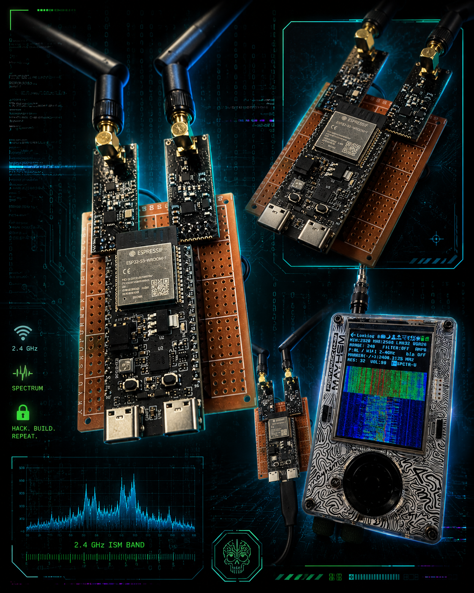
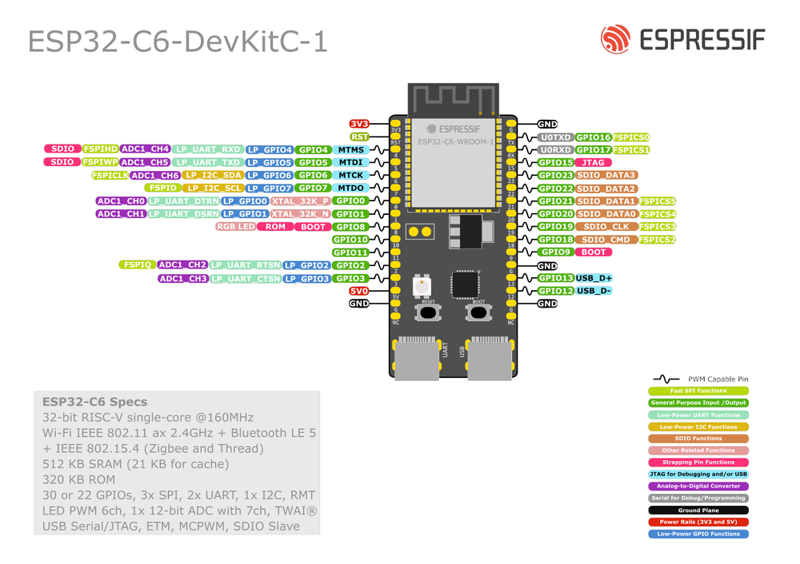
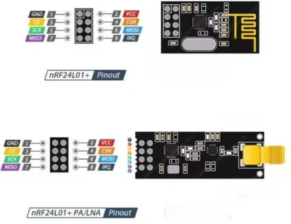

🐇 WhiteRabbit — Bluetooth/WiFi Jammer

  

ESP32-C6 + Dual NRF24L01 RF Disruption Tool
Built by x0jacob0x | Based on RF-Clown by CiferTech

⚠️ Disclaimer
This project is intended for educational and research purposes only. Jamming wireless signals may be illegal in your country or region. The author takes no responsibility for misuse. Always operate within the bounds of your local laws.

📖 About
WhiteRabbit is a Bluetooth/WiFi jammer built on the ESP32-C6-WROOM-1 using two NRF24L01 radio modules running simultaneously to maximize 2.4 GHz channel disruption. This project is heavily inspired by and based upon the excellent RF-Clown project by CiferTech — huge thanks to them for the original work.

🛠️ Hardware

MCU: ESP32-C6-WROOM-1
Radios: 2× NRF24L01 (or NRF24L01+PA+LNA for extended range)

🔌 Wiring / Pin Map
| Signal |      Radio 1 |      Radio 2 |
| ------ | -----------: | -----------: |
| VCC    |   3V3 shared |   3V3 shared |
| GND    |   GND shared |   GND shared |
| CE     |       GPIO10 |       GPIO11 |
| CSN    |       GPIO17 |       GPIO16 |
| SCK    | GPIO6 shared | GPIO6 shared |
| MOSI   | GPIO7 shared | GPIO7 shared |
| MISO   | GPIO2 shared | GPIO2 shared |

  
  

Note: NRF24L01 modules run on 3.3V — do not connect to 5V or you will damage them. Adding a 10µF decoupling capacitor across VCC/GND on each module is strongly recommended for stability.

🚀 How To Use:
Press Boot to switch modes
White - Device waiting
Blue - BlE/Bluetooth
Red - WiFi

📡 How It Works
WhiteRabbit uses both NRF24L01 modules to rapidly hop across Bluetooth/WiFi channels and transmit noise, disrupting Bluetooth/WiFi communication in the vicinity. 

🙏 Credits & Acknowledgements
This project would not exist without the foundational work of:
► CiferTech — Original RF-Clown Project
🐙 GitHubgithub.com/cifertech/RF-Clown💬 Twitter@CiferTech☕ Patreonpatreon.com/cifertech📧 EmailCiferTech@gmail.com

👤 Author
x0jacob0x
